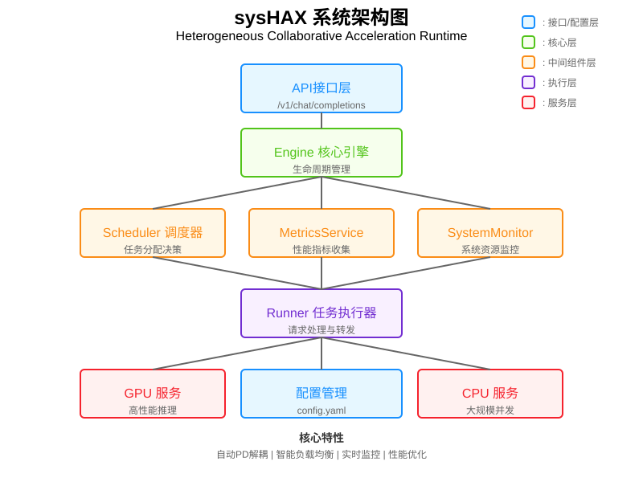

# sysHAX

#### 介绍
**sysHAX Heterogeneous collaborative acceleration runtime**（异构协作加速运行时）是一个高性能的AI推理任务调度系统，能够智能地在CPU和GPU之间分配任务，实现资源的高效利用和推理性能的优化。

#### 软件架构
sysHAX采用微服务架构设计，主要包含以下核心组件：

1. **核心引擎(Engine)**：负责整体系统的生命周期管理和调度循环
2. **调度器(Scheduler)**：根据系统监控指标做出智能调度决策，分配任务到合适的设备
3. **任务执行器(Runner)**：负责向CPU或GPU服务发送请求并处理响应
4. **系统监控器(SystemMonitor)**：实时监控系统资源使用情况
5. **指标服务(MetricsService)**：收集和报告任务执行性能数据

系统支持自动PD解耦(prefill-decode offload)功能，可根据任务特性和系统状态进行智能优化，提高推理效率。



#### 安装教程
##### 环境准备

| KEY        |  VALUE                                   |
| ---------- | ---------------------------------------- |
| 服务器型号  |  鲲鹏920系列CPU                           |
| GPU        |  Nvidia A100                              |
| 操作系统    | openEuler 24.03 LTS SP1                 |
| python     | 3.9及以上                                 |
| docker     | 25.0.3及以上                              |

- docker 25.0.3可通过 `dnf install moby` 进行安装。
- 请注意，sysHAX目前在AI加速卡侧只对NVIDIA GPU进行了适配，ASCEND NPU适配正在进行中。

##### 部署流程

首先需要通过 `nvidia-smi` 和 `nvcc -V` 检查是否已经安装好了nvidia驱动和cuda驱动，如果没有的话需要首先安装nvidia驱动和cuda驱动。

##### 安装NVIDIA Container Toolkit（容器引擎插件）

已经安装NVIDIA Container Toolkit可忽略该步骤。否则按照如下流程安装：

<https://docs.nvidia.com/datacenter/cloud-native/container-toolkit/latest/install-guide.html>

- 执行 `systemctl restart docker` 命令重启docker，使容器引擎插件在docker配置文件中添加的内容生效。

##### 容器场景vllm搭建

如下流程为在GPU容器中部署vllm。

```shell
docker pull hub.oepkgs.net/neocopilot/syshax/syshax-vllm-gpu:0.2.1

docker run --name vllm_gpu \
    --ipc="shareable" \
    --shm-size=64g \
    --gpus=all \
    -p 8001:8001 \
    -v /home/models:/home/models \
    -w /home/ \
    -itd hub.oepkgs.net/neocopilot/syshax/syshax-vllm-gpu:0.2.1 bash
```

在上述脚本中：

- `--ipc="shareable"`：允许容器共享IPC命名空间，可进行进程间通信。
- `--shm-size=64g`：设置容器共享内存为64G。
- `--gpus=all`：允许容器使用宿主机所有GPU设备
- `-p 8001:8001`：端口映射，将宿主机的8001端口与容器的8001端口进行映射，开发者可自行修改。
- `-v /home/models:/home/models`：目录挂载，将宿主机的 `/home/models` 映射到容器内的 `/home/models` 内，实现模型共享。开发者可自行修改映射目录。

```shell
vllm serve /home/models/DeepSeek-R1-Distill-Qwen-32B \
    --served-model-name=ds-32b \
    --host 0.0.0.0 \
    --port 8001 \
    --dtype=half \
    --swap_space=16 \
    --block_size=16 \
    --preemption_mode=swap \
    --max_model_len=8192 \
    --tensor-parallel-size 2 \
    --gpu_memory_utilization=0.8 \
    --enable-auto-pd-offload
```

在上述脚本中：

- `--tensor-parallel-size 2`：启用张量并行，将模型拆分到2张GPU上运行，需至少2张GPU，开发者可自行修改。
- `--gpu_memory_utilization=0.8`：限制显存使用率为80%，避免因为显存耗尽而导致服务崩溃，开发者可自行修改。
- `--enable-auto-pd-offload`：启动在swap out时触发PD分离。

如下流程为在CPU容器中部署vllm。

```shell
docker pull hub.oepkgs.net/neocopilot/syshax/syshax-vllm-cpu:0.2.1

docker run --name vllm_cpu \
    --ipc container:vllm_gpu \
    --shm-size=64g \
    --privileged \
    -p 8002:8002 \
    -v /home/models:/home/models \
    -w /home/ \
    -itd hub.oepkgs.net/neocopilot/syshax/syshax-vllm-cpu:0.2.1 bash
```

在上述脚本中：

- `--ipc container:vllm_gpu`共享名为vllm_gpu的容器的IPC（进程间通信）命名空间。允许此容器直接通过共享内存交换数据，避免跨容器复制。

```shell
NRC=4 INFERENCE_OP_MODE=fused OMP_NUM_THREADS=160 CUSTOM_CPU_AFFINITY=0-159 SYSHAX_QUANTIZE=q4_0 \
vllm serve /home/models/DeepSeek-R1-Distill-Qwen-32B \
    --served-model-name=ds-32b \
    --host 0.0.0.0 \
    --port 8002 \
    --dtype=half \
    --block_size=16 \
    --preemption_mode=swap \
    --max_model_len=8192 \
    --enable-auto-pd-offload
```

在上述脚本中：

- `INFERENCE_OP_MODE=fused`：启动CPU推理加速
- `OMP_NUM_THREADS=160`：指定CPU推理启动线程数为160，该环境变量需要在指定INFERENCE_OP_MODE=fused后才能生效
- `CUSTOM_CPU_AFFINITY=0-159`：指定CPU绑核方案，后续会详细介绍。
- `SYSHAX_QUANTIZE=q4_0`：指定量化方案为q4_0。当前版本支持2种量化方案：`q8_0`、`q4_0`。
- `NRC=4`：GEMV算子分块方式，该环境变量在920系列处理器上具有较好的加速效果。

需要注意的是，必须先启动GPU的容器，才能启动CPU的容器。

通过lscpu来检查当前机器的硬件情况，其中重点需要关注的是：

```shell
Architecture:             aarch64
  CPU op-mode(s):         64-bit
  Byte Order:             Little Endian
CPU(s):                   160
  On-line CPU(s) list:    0-159
Vendor ID:                HiSilicon
  BIOS Vendor ID:         HiSilicon
  Model name:             -
    Model:                0
    Thread(s) per core:   1
    Core(s) per socket:   80
    Socket(s):            2
NUMA:
  NUMA node(s):           4
  NUMA node0 CPU(s):      0-39
  NUMA node1 CPU(s):      40-79
  NUMA node2 CPU(s):      80-119
  NUMA node3 CPU(s):      120-159
```

该机器共有160个物理核心，没有开启SMT，共有4个NUMA，每个NUMA上有40个核心。

通过这两条脚本来设定绑核方案：`OMP_NUM_THREADS=160 CUSTOM_CPU_AFFINITY=0-159`。在这两条环境变量中，第一条为CPU推理启动线程数，第二条为绑定的CPU的ID。在 CPU推理加速中为实现NUMA亲和，需要进行绑核操作，要遵循如下规则：

- 启动线程数要与绑定的CPU个数相同；
- 每一个NUMA上使用的CPU个数需要相同，以保持负载均衡。

例如，在上述脚本中，绑定了0-159号CPU。其中，0-39属于0号NUMA节点，40-79属于1号NUMA节点，80-119属于2号NUMA节点，120-159属于3号NUMA节点。每个NUMA均使用了40个CPU，保证了每个NUMA的负载均衡。

##### 安装sysHAX软件包

sysHAX安装有两种方式，可以通过dnf安装rpm包。注意，使用该方法需要将openEuler升级至openEuler 24.03 LTS SP2及以上版本：

```shell
dnf install sysHAX
```

或者直接使用源码启动：

```shell
git clone -b v0.2.0 https://gitee.com/openeuler/sysHAX.git
```

在启动sysHAX之前需要进行一些基础配置：

```shell
# 使用 dnf install sysHAX 安装sysHAX时
syshax init
syshax config services.gpu.port 8001
syshax config services.cpu.port 8002
syshax config services.conductor.port 8010
syshax config models.default ds-32b
```

```shell
# 使用 git clone -b v0.2.0 https://gitee.com/openeuler/sysHAX.git 时
python3 cli.py init
python3 cli.py config services.gpu.port 8001
python3 cli.py config services.cpu.port 8002
python3 cli.py config services.conductor.port 8010
python3 cli.py config models.default ds-32b
```

此外，也可以通过 `syshax config --help` 或者 `python3 cli.py config --help` 来查看全部配置命令。

配置完成后，通过如下命令启动sysHAX服务：

```shell
# 使用 dnf install sysHAX 安装sysHAX时
syshax run
``` 

```shell
# 使用 git clone -b v0.2.0 https://gitee.com/openeuler/sysHAX.git 时
python3 main.py
```

启动sysHAX服务的时候，会进行服务连通性测试。sysHAX符合openAPI标准，待服务启动完成后，即可API来调用大模型服务。可通过如下脚本进行测试：

```shell
curl http://0.0.0.0:8010/v1/chat/completions -H "Content-Type: application/json" -d '{
    "model": "ds-32b",
    "messages": [
        {
            "role": "user",
            "content": "介绍一下openEuler。"
        }
    ],
    "stream": true,
    "max_tokens": 1024
}'
```

#### 参与贡献

1. Fork 本仓库
2. 新建 Feat_xxx 分支
3. 提交代码
4. 新建 Pull Request

#### 许可证

sysHAX 采用 Mulan PSL v2 许可证。详细信息请参见 LICENSE 目录下的文件。

#### 联系方式

如有问题或建议，请通过项目仓库的Issue系统提交。