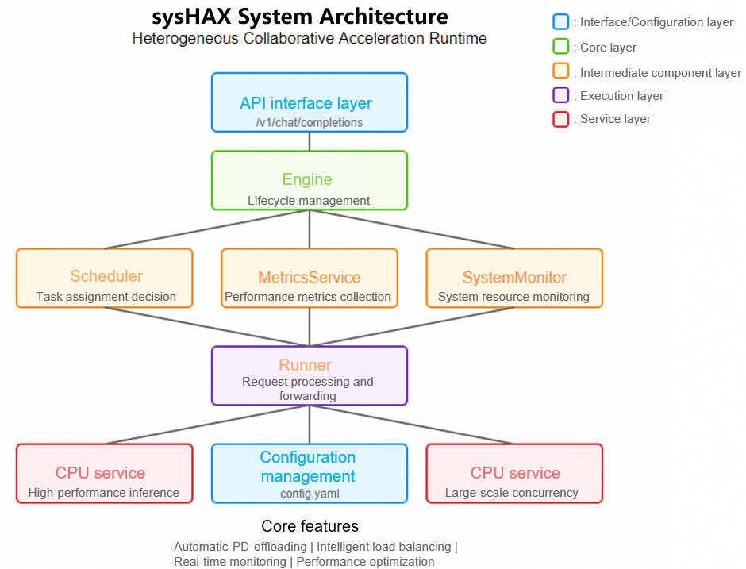

# sysHAX

## Overview

**sysHAX Heterogeneous collaborative acceleration runtime** is a high-performance AI inference task scheduling system that intelligently allocates tasks between CPUs and GPUs to optimize resource utilization and inference performance.

## Software Architecture

sysHAX adopts a microservice architecture and consists of the following core components:

1. **Engine**: manages the lifecycle and scheduling cycle of the entire system.
2. **Scheduler**: makes intelligent scheduling decisions based on system monitoring metrics and allocates tasks to appropriate devices.
3. **Runner**: sends requests to CPU or GPU services and processes responses.
4. **SystemMonitor**: monitors system resource usage in real time.
5. **MetricsService**: collects and reports task execution performance data.

The system supports the automatic prefill-decode (PD) offloading function, which can intelligently perform optimization based on task characteristics and system status to improve inference efficiency.



## Installation Tutorial

### Environment Setup

| KEY        |  VALUE                                   |
| ---------- | ---------------------------------------- |
| Server model  |  Kunpeng 920 series CPU                           |
| GPU        |  Nvidia A100                              |
| OS    | openEuler 24.03 LTS SP1                 |
| python     | 3.9 or later                                 |
| docker     | 25.0.3 or later                              |

- Docker 25.0.3 can be installed using `dnf install moby`.
- Note that sysHAX currently supports only NVIDIA GPUs on the AI accelerator card side. Adaptation to ASCEND NPUs is in progress.

### Deployment Process

First, use `nvidia-smi` and `nvcc -V` to check whether the NVIDIA driver and CUDA driver have been installed. If not, install them first.

#### Installing the NVIDIA Container Toolkit (Container Engine Plugin)

If the NVIDIA Container Toolkit has been installed, skip this step. If it has not been installed, perform the following steps to install it:

<https://docs.nvidia.com/datacenter/cloud-native/container-toolkit/latest/install-guide.html>

- Run the `systemctl restart docker` command to restart the Docker, so the content added by the container engine plugin to the Docker configuration file can take effect.

##### Setting Up VLLM in Container Scenarios

The following describes how to deploy VLLM in a GPU container.

```shell
docker pull hub.oepkgs.net/neocopilot/syshax/syshax-vllm-gpu:0.2.1

docker run --name vllm_gpu \
    --ipc="shareable" \
    --shm-size=64g \
    --gpus=all \
    -p 8001:8001 \
    -v /home/models:/home/models \
    -w /home/ \
    -itd hub.oepkgs.net/neocopilot/syshax/syshax-vllm-gpu:0.2.1 bash
```

In the preceding script:

- `--ipc="shareable"`: allows the container to share the IPC namespace for inter-process communication.
- `--shm-size=64g`: sets the shared memory of the container to 64 GB.
- `--gpus=all`: allows the container to use all GPUs of the host.
- `-p 8001:8001`: maps port 8001 of the host to port 8001 of the container. You can change the mapping as required.
- `-v /home/models:/home/models`: maps the `/home/models` directory of the host to the `/home/models` directory of the container to implement model sharing. You can change the mapping directory as required.

```shell
vllm serve /home/models/DeepSeek-R1-Distill-Qwen-32B \
    --served-model-name=ds-32b \
    --host 0.0.0.0 \
    --port 8001 \
    --dtype=half \
    --swap_space=16 \
    --block_size=16 \
    --preemption_mode=swap \
    --max_model_len=8192 \
    --tensor-parallel-size 2 \
    --gpu_memory_utilization=0.8 \
    --enable-auto-pd-offload
```

In the preceding script:

- `--tensor-parallel-size 2`: enables tensor parallelism and splits the model to run on two GPUs. At least two GPUs are required. You can modify the value as required.
- `--gpu_memory_utilization=0.8`: limits the GPU memory usage to 80% to prevent service breakdown caused by GPU memory exhaustion. You can modify the value as required.
- `--enable-auto-pd-offload`: enables PD offloading when swap-out is triggered.

The following describes how to deploy VLLM in a CPU container.

```shell
docker pull hub.oepkgs.net/neocopilot/syshax/syshax-vllm-cpu:0.2.1

docker run --name vllm_cpu \
    --ipc container:vllm_gpu \
    --shm-size=64g \
    --privileged \
    -p 8002:8002 \
    -v /home/models:/home/models \
    -w /home/ \
    -itd hub.oepkgs.net/neocopilot/syshax/syshax-vllm-cpu:0.2.1 bash
```

In the preceding script:

- `--ipc container:vllm_gpu` allows the IPC namespace of the container named vllm_gpu to be shared. This allows the container to exchange data through the shared memory, avoiding cross-container replication.

```shell
NRC=4 INFERENCE_OP_MODE=fused OMP_NUM_THREADS=160 CUSTOM_CPU_AFFINITY=0-159 SYSHAX_QUANTIZE=q4_0 \
vllm serve /home/models/DeepSeek-R1-Distill-Qwen-32B \
    --served-model-name=ds-32b \
    --host 0.0.0.0 \
    --port 8002 \
    --dtype=half \
    --block_size=16 \
    --preemption_mode=swap \
    --max_model_len=8192 \
    --enable-auto-pd-offload
```

In the preceding script:

- `INFERENCE_OP_MODE=fused`: enables CPU inference acceleration.
- `OMP_NUM_THREADS=160`: specifies 160 as the number of CPU inference startup threads. This environment variable takes effect only after `INFERENCE_OP_MODE` is set to `fused`.
- `CUSTOM_CPU_AFFINITY=0-159`: specifies the CPU core binding solution, which will be described in detail later.
- `SYSHAX_QUANTIZE=q4_0`: specifies q4_0 as the quantization solution. The current version supports two quantization solutions: `q8_0` and `q4_0`.
- `NRC=4`: specifies the mode of GEMV operator tiling. This environment variable has a good acceleration effect on 920 series processors.

Note that the GPU container must be started before the CPU container.

Run the **lscpu** command to check the hardware status of the server. Pay attention to the following:

```shell
Architecture:             aarch64
  CPU op-mode(s):         64-bit
  Byte Order:             Little Endian
CPU(s):                   160
  On-line CPU(s) list:    0-159
Vendor ID:                HiSilicon
  BIOS Vendor ID:         HiSilicon
  Model name:             -
    Model:                0
    Thread(s) per core:   1
    Core(s) per socket:   80
    Socket(s):            2
NUMA:
  NUMA node(s):           4
  NUMA node0 CPU(s):      0-39
  NUMA node1 CPU(s):      40-79
  NUMA node2 CPU(s):      80-119
  NUMA node3 CPU(s):      120-159
```

The server has 160 physical cores and four NUMA nodes, with 40 cores on each NUMA node. SMT is not enabled.

Use the following two scripts to set the core binding solution: `OMP_NUM_THREADS=160 CUSTOM_CPU_AFFINITY=0-159`. In the two environment variables, the first one indicates the number of CPU inference startup threads, and the second one indicates the ID of the bound CPU. To realize NUMA affinity in CPU inference acceleration, you need to perform core binding. The following rules must be followed:

- The number of startup threads must be the same as the number of bound CPUs.
- The number of CPUs used on each NUMA node must be the same to ensure load balancing.

For example, in the preceding script, CPUs 0 to 159 are bound. CPUs 0 to 39 belong to NUMA node 0, CPUs 40 to 79 belong to NUMA node 1, CPUs 80 to 119 belong to NUMA node 2, and CPUs 120 to 159 belong to NUMA node 3. Each NUMA node uses 40 CPUs to ensure that the load is balanced among the NUMAs.

##### Installing the sysHAX Package

Two methods are available to install sysHAX. One method is to use **dnf** command to install the RPM package. Note that this method requires openEuler to be upgraded to openEuler 24.03 LTS SP2 or later.

```shell
dnf install sysHAX
```

The other method is to use the source code to directly start sysHAX:

```shell
git clone -b v0.2.0 https://gitee.com/openeuler/sysHAX.git
```

Before starting sysHAX, perform the following basic configurations:

```shell
# If **dnf install sysHAX** is used to install sysHAX:
syshax init
syshax config services.gpu.port 8001
syshax config services.cpu.port 8002
syshax config services.conductor.port 8010
syshax config models.default ds-32b
```

```shell
# If git clone -b v0.2.0 https://gitee.com/openeuler/sysHAX.git is used:
python3 cli.py init
python3 cli.py config services.gpu.port 8001
python3 cli.py config services.cpu.port 8002
python3 cli.py config services.conductor.port 8010
python3 cli.py config models.default ds-32b
```

You can also run the `syshax config --help` or `python3 cli.py config --help` command to view all configuration commands.

After the configuration is complete, run the following command to start the sysHAX service:

```shell
# If **dnf install sysHAX** is used to install sysHAX:
syshax run
``` 

```shell
# If git clone -b v0.2.0 https://gitee.com/openeuler/sysHAX.git is used:
python3 main.py
```

When the sysHAX service is started, a service connectivity test is performed. sysHAX complies with the openAPI standard. After the service is started, you can use APIs to invoke the foundation model service. You can use the following script to perform a test:

```shell
curl http://0.0.0.0:8010/v1/chat/completions -H "Content-Type: application/json" -d '{
    "model": "ds-32b",
    "messages": [
        {
            "role": "user",
            "content": "Introduce openEuler."
        }
    ],
    "stream": true,
    "max_tokens": 1024
}'
```

#### How to Contribute

1. Fork this repository.
2. Create a Feat_xxx branch.
3. Commit your code.
4. Create a pull request (PR).

#### License

sysHAX is licensed under the Mulan PSL v2. For details, see the files in the **LICENSE** folder.

#### Contact Information

If you have any questions or suggestions, submit them through the Issue system of the project repository.
