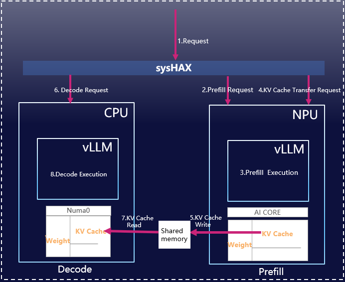

### 版本信息  
更新日期：2025年11月11日

***

# 1. 产品概述

## 1.1. sysHAX整体介绍



**sysHAX** 是一款面向 K+X（Kunpeng CPU + XPU\(GPU/NPU\)） 异构计算架构的推理加速系统，旨在通过智能任务调度与资源优化，充分发挥不同硬件平台（XPU与 CPU）的计算优势，实现大语言模型（LLM）推理性能的最大化。其核心功能定位为 **“异构融合推理加速”**，主要包含以下两大能力：

* **推理动态调度**

* **CPU 推理性能加速**

该系统特别针对 LLM 推理过程中不同阶段的计算特性进行优化，提升整体吞吐率与资源利用率。sysHAX目前的应用场景是单机多卡（CPU+XPU），未来计划支持多机多卡场景。

***

## 1.2. 推理动态调度


在典型的自回归文本生成过程中，推理可分为两个关键阶段：

* **Prefill 阶段**：对输入提示（prompt）进行上下文编码，属于计算密集型任务，适合在高算力设备（如 GPU 或 NPU）上执行。

* **Decode 阶段**：逐 token 生成输出内容，具有较高的内存访问频率和较低的计算强度，属于访存密集型任务，更适合在具备高内存带宽和灵活调度能力的 CPU 上运行。

为了充分利用以上特性，sysHAX基于vllm推理框架 实现了 **动态任务拆分（PD分离）与调度机制（Decode任务的动态调度）**。

* **PD分离**：将全部的 Prefill 请求路由至 XPU（GPU/NPU），而将 Decode 请求则交由XPU和优化后的 CPU 后端处理，从而实现计算资源的最优匹配与利用。

* **Decode任务的动态调度**: 根据XPU和CPU上的实时负载，动态将Decode请求分配到负载更低的设备处理，以实现吞吐最大化。

## 1.3. CPU 推理加速

为了提升 Decode 阶段在 CPU 端的执行效率，sysHAX 在底层集成了多项性能优化技术，包括：

* **NUMA 亲和性调度**：确保线程与本地内存节点绑定，减少跨节点访问延迟。

* **多级并行优化**：充分利用多核并发能力，提升指令级与任务级并行度。

* **算子级优化**：应用NEON、i8mm等加速算子，大幅提升推理过程中的矩阵乘积等计算速度，显著降低计算开销。

这些优化显著提升了 CPU 在 LLM 推理中的响应速度与吞吐能力。

***

# 2. 组件介绍

|**组件**|**运行的设备**|介绍|
|---|---|---|
|vllm\(CPU\)|CPU|主要处理一部分Decode请求|
|vllm\(NPU\)|NPU|主要处理全部的Prefill请求和一部分Decode请求|
|sysHAX|CPU|代理用户的请求，将所有的Prefill请求发往vllm\(NPU\)。根据负载均衡的情况，将Decode请求发往vllm\(CPU\)或vllm\(NPU\)|

***

# 3. 软件环境

|**类型**|**版本要求**|**说明**|
|---|---|---|
|操作系统|openEuler 22.03 LTS 、openEuler 24.03 LTS|\-|
|内核版本|6.6.0\-28.0.0.34.oe2403.aarch64|uname \-r可查看内核版本|
|python|3.11及以上|部署vllm服务需要python|
|docker|25.0.3及以上|用docker将vllm\(CPU\)和vllm\(XPU\)的配置环境隔离，避免互相干扰。|
|昇腾NPU驱动|25.2.2或者其他版本|部署在昇腾AI处理器，用于管理查询昇腾AI处理器，同时为上层CANN软件提供处理器控制、资源分配等接口。如果没有可参照[https://www.hiascend.com/document/detail/zh/canncommercial/82RC1/softwareinst/instg/instg\_0005.html?Mode=PmIns&amp;InstallType=netyum&amp;OS=openEuler&amp;Software=cannToolKit](https://www.hiascend.com/document/detail/zh/canncommercial/82RC1/softwareinst/instg/instg_0005.html?Mode=PmIns&InstallType=netyum&OS=openEuler&Software=cannToolKit)进行安装|
|昇腾NPU固件|7.7.0.10.220或者其他版本|固件包含昇腾AI处理器自带的OS 、电源器件和功耗管理器件控制软件，分别用于后续加载到AI处理器的模型计算、处理器启动控制和功耗控制。如果没有可参照[https://www.hiascend.com/document/detail/zh/canncommercial/82RC1/softwareinst/instg/instg\_0005.html?Mode=PmIns&amp;InstallType=netyum&amp;OS=openEuler&amp;Software=cannToolKit](https://www.hiascend.com/document/detail/zh/canncommercial/82RC1/softwareinst/instg/instg_0005.html?Mode=PmIns&InstallType=netyum&OS=openEuler&Software=cannToolKit)进行安装|
|Toolkit|8.2.RC1|CANN开发套件包，在训练&amp;推理&amp;开发调试场景下安装，主要用于训练和推理业务、模型转换、算子/应用/模型的开发和编译。如果没有可参照[https://www.hiascend.com/document/detail/zh/canncommercial/82RC1/softwareinst/instg/instg\_0005.html?Mode=PmIns&amp;InstallType=netyum&amp;OS=openEuler&amp;Software=cannToolKit](https://www.hiascend.com/document/detail/zh/canncommercial/82RC1/softwareinst/instg/instg_0005.html?Mode=PmIns&InstallType=netyum&OS=openEuler&Software=cannToolKit)进行安装|
|模型|DeepSeek\-R1\-Distill\-Qwen\-32B|文档中以DeepSeek\-R1\-Distill\-Qwen\-32B为例介绍，可将DeepSeek\-R1\-Distill\-Qwen\-32B改为需要部署的模型。将需要部署的模型放在/home/models路径下|

***

# 4. 硬件规格

|**类型**|**型号**|**说明**|
|---|---|---|
|NPU|Atlas 300i duo|vllm\(NPU\)运行在300i duo上|
|服务器|920系列arm架构服务器，推荐920 7270Z以上系列|推理加速的功能是参考920服务器（特别是920 7280Z服务器）的特性实现。|

***

# 5. 快速开始

先把模型存放在宿主机的/home/models路径下，然后在创建容器时将/home/models挂载到容器内的相同路径，就可以在容器内访问模型了。推理前，需要先搭建vllm\(NPU\)容器、vllm\(CPU\)容器、sysHAX服务。

## 5.1. 搭建vllm\(NPU\)容器

### 5.1.1. 创建vllm（NPU）容器

```shell
# 从远端拉取vllm(NPU)的docker镜像
docker pull hub.oepkgs.net/neocopilot/syshax/syshax-vllm-310p:0.2.1

# docker创建名为vllm-mindspore-310p-share的容器，创建完容器自动进入容器的工作目录
docker run \
--privileged \
--name vllm-mindspore-310p-share \
--ipc="shareable" \
--shm-size=64g \
--device /dev/davinci0 \
--device /dev/davinci1 \
--device /dev/davinci2 \
--device /dev/davinci3 \
--device /dev/davinci_manager \
--device /dev/devmm_svm \
--device /dev/hisi_hdc \
-p 8001:8001 \
-v /usr/local/dcmi:/usr/local/dcmi \
-v /usr/local/bin/npu-smi:/usr/local/bin/npu-smi \
-v /usr/local/Ascend/driver/lib64/:/usr/local/Ascend/driver/lib64/ \
-v /usr/local/Ascend/driver/version.info:/usr/local/Ascend/driver/version.info \
-v /etc/ascend_install.info:/etc/ascend_install.info \
-v /home/models/:/home/models \
--net=host \
-it hub.oepkgs.net/neocopilot/syshax/syshax-vllm-310p:0.2.1 bash

```

docker run命令的参数解释：

|**参数**|**解释**|
|---|---|
|name |指定容器名。|
|ipc |ipc命名空间，用来使能vllm\(CPU\)和vllm\(XPU\)之间的通信。有两种ipc通信方式：容器a的ipc设置为"shareable"，容器b的ipc设置为"container:容器a的容器名"，表示这两个容器共享ipc命名空间；两个容器的ipc都设置为"host"，表示两个容器跟宿主机共享命名空间。|
|shm\-size|设置容器的共享内存大小，单位为GB。|
|privileged|授予容器特权模式，使其拥有对主机设备的广泛访问权限。|
|device|将宿主机的设备文件映射到容器内部，让容器能够访问硬件设备。注意/dev/davinci0~/dev/davinci3代表NPU卡，可在安装好NPU驱动和固件后使用ls /dev或者npu\-smi info查看当前机器内有多少张卡。|
|p|port的缩写。将容器内端口映射到宿主机端口。|
|v|将宿主机的目录挂载到容器的路径。|
|net|\-\-net=host 让容器共享主机网络。|
|w|设置容器的工作目录。|
|it| \-i：保持 STDIN 打开。\-t： 分配伪终端。|
|hub.oepkgs.net/neocopilot/syshax/syshax\-vllm\-310p:0.2.1|指定使用的容器镜像名称及版本。此容器内已经配置好相关需要的环境。|

### 5.1.2. 部署

部署起服务后，就可以发请求测试是否部署成功了。

```shell
# 在容器内的/workspace路径下执行以下命令

# 给./run_mcore.sh添加可执行的权限
chmod +x run_mcore.sh

# 进入到run_mcore.sh文件，修改vllm-mindspore serve命令的对应参数（特别是部署的模型路径），修改完保存退出
vi ./run_mcore.sh

# 执行./run_mcore.sh
./run_mcore.sh
```

假设./run\_mcore.sh中的vllm\-mindspore serve命令为

vllm\-mindspore serve /home/models/DeepSeek\-R1\-Distill\-Qwen\-32B \-\-trust\_remote\_code \-\-tensor\_parallel\_size=4 \-\-max\-num\-seqs=256 \-\-block\-size=128 \-\-gpu\-memory\-utilization=0.8 \-\-max\_model\_len=8192 \-\-max\-num\-batched\-tokens=8192 \-\-enable\_auto\_pd\_offload，那么vllm\-mindspore serve命令的参数解释如下：

|**参数**|**解释**|
|---|---|
|/home/models/DeepSeek\-R1\-Distill\-Qwen\-32B|模型存储路径。|
|trust\_remote\_code|允许加载和执行模型中的自定义代码。|
|block\_size|定义 PagedAttention 中KV Cache块的大小，表示一个KV Cache块中包含的token的个数。针对300i duo，通常设置为16、128。|
|max\-num\-seqs|同时处理的最大请求序列数量。|
|max\-num\-batched\-tokens|单次批处理的最大 token 数量。|
|max\_model\_len|设置模型支持的最大上下文长度（提问+回答的总token长度）。|
|tensor\-parallel\-size|张量并行度，表示将模型切分到多少张 NPU 卡上。|
|gpu\_memory\_utilization|NPU 内存利用率上限。|
|enable\_auto\_pd\_offload|如果需要支持sysHAX的PD分离功能，需要加上enable\_auto\_pd\_offload。|

需要注意的是，如果希望使用sysHAX进行调度，必须启动PD分离功能，此时需要在vllm\-mindspore serve命令中加入enable\_auto\_pd\_offload参数。

**Tips**

* **如何设置tensor\-parallel\-size?**

使用npu\-smi info命令可以查看GPU的卡数和每张卡的显存量。需保证tensor\-parallel\-size不超过NPU总卡数。

* **如何设置gpu\_memory\_utilization?**

保证：模型运行时的显存开销&lt;=服务器的可用显存。

模型运行时的显存开销包括模型权重占用的显存开销以及额外显存开销（KV 缓存、激活值、临时缓冲区等），为了方便计算，模型运行时的显存开销可以简单算作模型权重的1.2\-1.5倍。模型权重=权重数量 \* 权重数值类型。例如，对于32B模型，部署服务时设置dtype为half，那么每个参数占2字节，一共32B参数，因此模型权重占64B，模型运行时的显存开销大概为76.8\-96B。

服务器的可用显存=服务器中GPU的卡数 x 每张卡的显存量 x gpu\_memory\_utilization。服务器中GPU的卡数和 每张卡的显存量可以通过npu\-smi info命令查看。

## 5.2. 搭建vllm\(CPU\)容器

### 5.2.1. 创建vllm\(CPU\)容器

```shell
# 从远端仓库拉取镜像，镜像中配置了vllm(CPU)的相关环境
docker pull hub.oepkgs.net/neocopilot/syshax/syshax-vllm-cpu:0.2.1
# 创建名为vllm_cpu的容器，跟名为vllm_gpu的容器共享IPC资源。创建完容器自动进入容器的工作目录
docker run --name vllm_cpu \
    --ipc container:vllm-mindspore-310p-share \
    --shm-size=64g \
    --privileged \
    -p 8002:8002 \
    -v /home/models:/home/models \
    -w /home/ \
    -it hub.oepkgs.net/neocopilot/syshax/syshax-vllm-cpu:0.2.1 bash

```

docker run命令的参数解释：

|**参数**|**解释**|
|---|---|
|name |指定容器名。|
|ipc |ipc命名空间，用来使能vllm\(CPU\)和vllm\(NPU\)之间的通信。有两种ipc通信方式：容器a的ipc设置为"shareable"，容器b的ipc设置为"container:容器a的容器名"，表示这两个容器共享ipc命名空间；两个容器的ipc都设置为"host"，表示两个容器跟宿主机共享命名空间。|
|shm\-size|设置容器的共享内存大小，单位为GB。|
|privileged|授予容器特权模式，使其拥有对主机设备的广泛访问权限。|
|p|port的缩写。将容器内端口映射到宿主机端口。|
|v|将宿主机的目录挂载到容器的路径。|
|w|设置容器的工作目录。|
|it| \-i：保持 STDIN 打开。\-t： 分配伪终端。|
|hub.oepkgs.net/neocopilot/syshax/syshax\-vllm\-cpu|指定使用的容器镜像名称及版本。hub.oepkgs.net/neocopilot/syshax/syshax\-vllm\-cpu镜像已经配置好了vllm\(CPU\)，使用此镜像无需再进行配置|

### 5.2.2. 部署

```shell

#部署vllm(CPU)服务。要开启pd分离，要添加--enable_auto_pd_offload
INFERENCE_OP_MODE=fused OMP_NUM_THREADS=160 CUSTOM_CPU_AFFINITY=0-159 SYSHAX_QUANTIZE=q4_0 NRC=4 \
vllm serve /home/models/DeepSeek-R1-Distill-Qwen-32B \
    --host 0.0.0.0 \
    --port 8002 \
    --dtype=half \
    --block_size=16 \
    --preemption_mode=swap \
    --max_model_len=8192 \
    --enable_auto_pd_offload
```

|**参数**|**解释**|
|---|---|
|INFERENCE\_OP\_MODE|vllm\_syshax自定义环境变量，表示是否启动CPU推理加速。可选值：fused、None。|
|OMP\_NUM\_THREADS|vllm\_syshax自定义环境变量，表示CPU推理加速时开启的线程数量。其值&lt;=可用的CPU核的数量。用lscpu命令可查看服务器中的CPU核数。|
|CUSTOM\_CPU\_AFFINITY|vllm\_syshax自定义环境变量，表示将线程绑定到哪些CPU核。注意这里的线程数量要跟OMP\_NUM\_THREADS一致，并且每个numa的线程数量要相等。格式为“start\-end:step”，step默认为1。例如，0\-159:2中，0、159、2分别代表开始的线程序号、结束的线程序号（包含）、步长。|
|SYSHAX\_QUANTIZE|vllm\_syshax自定义环境变量，表示采用的量化方式。不设置时默认不量化，设置时可选值为q8\_0、q4\_0，表示进行q8\_0量化、q4\_0量化。|
|NRC|vllm\_syshax自定义环境变量，表示i8mm指令处理的矩阵分块的大小。可选值为2、4。|
|/home/models/DeepSeek\-R1\-Distill\-Qwen\-32B|模型存储路径。|
|host |指定服务器监听的网络接口。|
|port |指定服务器监听的网络端口号。|
|dtype|指定模型权重加载的数据类型。可选值为auto、half、bfloat16、float32。|
|block\_size|定义 PagedAttention 中KV Cache块的大小，表示一个KV Cache块中包含的token的个数。可选值为8，16。|
|preemption\_mode|当新请求到达而资源不足时，vLLM 支持通过“抢占”旧请求的方式释放资源。该参数控制如何处理被抢占的请求。可选值为recompute、swap、none。|
|max\_model\_len|设置模型支持的最大上下文长度（提问+回答的总token长度）。|
|enable\_auto\_pd\_offload|如果需要支持sysHAX的PD分离功能，需要加上enable\_auto\_pd\_offload。|

### 5.2.3. 部署样例

下面使用一个920 7280Z的服务器为例，展示如何设置vllm serve命令的参数。


解释lscpu输出中的重点数值：

|**参数**|**解释**|
|---|---|
|On\-line CPU\(s\) list:  0\-159|在线 CPU 列表为0\-159。说明服务器可以开启160个虚线程（通常等于Socket\(s\) \* Core\(s\) per socket）|
|BIOS Model name:      Kunpeng 920 7280Z|CPU型号为Kunpeng 920 7280Z。目前CPU推理加速在Kunpeng 920 7270Z和Kunpeng 920 7280Z上支持效果最好。|
|Thread\(s\) per core:   1|每个核心1个线程（无超线程）|
|Core\(s\) per socket:   80|每个CPU插槽80个物理核心|
|Socket\(s\):            2|2个CPU插槽（2路服务器）|
|Flags:                fp asimd evtstrm aes pmull sha1 sha2 crc32 atomics fphp asimdhp cpuid asimdrdm jscvt fcma lrcpc dcpop sha3 sm3 sm4 asimddp sha512 sve asimdfhm dit uscat ilrcpc flagm ssbs sb paca pacg dcpodp flagm2 frint svei8mm svef32mm svef64mm                         svebf16 i8mm bf16 dgh rng ecv|Flags 列出了CPU支持的特性。其中比较重要的是asimd 、sve 、svei8mm 、i8mm。如果缺少i8mm、asimd ，那CPU的推理加速的速度会受到较大影响。|
|NUMA:<br>NUMA node\(s\):4<br>  NUMA node0 CPU\(s\):    0\-39<br>  NUMA node1 CPU\(s\):    40\-79<br>  NUMA node2 CPU\(s\):    80\-119<br>  NUMA node3 CPU\(s\):    120\-159<br>|**NUMA node\(s\): 4** \- 4个NUMA节点。**NUMA node0 CPU\(s\): 0\-39** \- 节点0包含CPU 0\-39。**NUMA node1 CPU\(s\): 40\-79** \- 节点1包含CPU 40\-79。**NUMA node2 CPU\(s\): 80\-119** \- 节点2包含CPU 80\-119。**NUMA node3 CPU\(s\): 120\-159** \- 节点3包含CPU 120\-159。|

这个服务器有4个numa，每个numa拥有40个物理核。根据不同的使用场景，可以如下设置：

|**场景**|**参考部署服务命令**|
|---|---|
|只运行sysHAX跟vllm服务。并且需要CPU高速推理。|INFERENCE\_OP\_MODE=fused OMP\_NUM\_THREADS=160 CUSTOM\_CPU\_AFFINITY=0\-159 SYSHAX\_QUANTIZE=q4\_0 NRC=4 vllm serve /home/models/DeepSeek\-R1\-Distill\-Qwen\-32B \-\-host 0.0.0.0 \-\-port 8002 \-\-dtype=half  \-\-block\_size=16 \-\-preemption\_mode=swap \-\-max\_model\_len=8192|
|除了运行sysHAX跟vllm服务外，还需留部分算力给其他进程。需要CPU中等速度推理。|INFERENCE\_OP\_MODE=fused OMP\_NUM\_THREADS=120 CUSTOM\_CPU\_AFFINITY=0\-29,40\-69,80\-109,120\-149 SYSHAX\_QUANTIZE=q4\_0 NRC=4 vllm serve /home/models/DeepSeek\-R1\-Distill\-Qwen\-32B \-\-host 0.0.0.0 \-\-port 8002 \-\-dtype=half  \-\-block\_size=16 \-\-preemption\_mode=swap \-\-max\_model\_len=8192|

## 5.3. 搭建sysHAX服务

在sysHAX场景中，用户需要将请求发往sysHAX服务。sysHAX根据CPU和NPU的特性（CPU内存大但是算力弱，NPU内存小但是算力强）分配Prefill和Decode请求。sysHAX采用了PD分离的技术，因此需要vllm\(CPU\)和vllm\(NPU\)也各自支持PD分离。启动vllm\(CPU\)和vllm\(NPU\)的服务时加上启动参数enable\_auto\_pd\_offload，就可以让它们支持PD分离特性。

目前已经搭建好vllm\(CPU\)容器和vllm\(NPU\)容器了，现在搭建sysHAX服务对vllm\(CPU\)、vllm\(NPU\)实现异构调度。

sysHAX服务在宿主机搭建，一共包含两个步骤：配置sysHAX、启动sysHAX。

### 5.3.1. 配置sysHAX

下载sysHAX源代码，并配置sysHAX。

```shell
# 下载sysHAX源代码。目前sysHAX更新到0.2.1版本，下载最新的版本的代码
git clone -b v0.2.1 https://gitee.com/openeuler/sysHAX.git

# 现在开始配置sysHAX

# 初始化一个新的配置文件，这一命令会在根目录的config文件夹下生成一个yaml文件，主要用以配置vllm(CPU)、vllm(NPU)、sysHAX的对应ip地址以及端口，和模型名model_name
python3 cli.py init

# python3 cli.py init生成的配置文件中，CPU、NPU、sysHAX的对应ip地址初始为0.0.0.0，即本机ip。由于目前sysHAX在本机下运行vllm(CPU)、vllm(NPU)、sysHAX，因此这里不设置他们的ip

# 对python3 cli.py init生成的yaml配置文件设置NPU端口，sysHAX将使用此端口访问vllm(NPU)
python3 cli.py config gpu.port 8001

#  对python3 cli.py init生成的yaml配置文件设置CPU端口，sysHAX将使用此端口访问vllm(CPU)
python3 cli.py config cpu.port 8002

# 配置sysHAX的端口。sysHAX代理用户请求，即用户将请求发给sysHAX，sysHAX再决定将请求发给vllm(CPU)还是vllm(NPU)
python3 cli.py config conductor.port 8010

# 配置sysHAX是否开启自动 PD offload（true/false）。如果需要开启PD分离，在NPU上做Prefill，在CPU和NPU上做Decode，则开启；否则关闭
python3 cli.py config auto_pd_offload true

# 配置sysHAX在CPU 侧最大并发量。这里示例设置为50，请根据实际情况设置
python3 cli.py config cpu_max_batch_size 50

# 配置sysHAX请求超时时间（秒）。这里设置为3600s，请根据实际情况设置
python3 cli.py config request_timeout 3600
```

### 5.3.2. 启动sysHAX

```shell
#启动sysHAX有两种方式
#方式一
python3 main.py
#方式二
python3 cli.py run
```

如果希望查看详细的DEBUG信息，可以设置环境变量DEBUG=1再启动sysHAX。如果希望查看sysHAX的所有配置命令，可以执行python3 cli.py config \-\-help。

## 5.4. 发起推理请求

至此，已经部署完成vllm\(CPU\)、vllm\(NPU\)以及sysHAX，现在来发起推理请求。

### 5.4.1. curl请求

```shell
curl http://0.0.0.0:8010/v1/chat/completions -H "Content-Type: application/json" -d '{
    "messages": [
        {
            "role": "user",
            "content": "介绍一下openEuler。"
        }
    ],
    "stream": true,
    "max_tokens": 1024
}'
```

|**参数**|**解释**|
|---|---|
|http://0.0.0.0:8010/v1/chat/completions|格式：协议://ip地址:端口/路径。含义：向运行在本地（0.0.0.0）或远程主机（x.x.x.x）上、监听 8010 端口的一个 LLM 推理服务，发送一个符合 OpenAI 格式的聊天补全请求。|
|stream|启用流式传输，结果将以数据流形式逐步返回\(一个token一个token地返回\)。stream设置为false可一次性返回所有生成的内容。|
|max\_tokens|限制响应生成的最大token数|

***

# 6. 附录

## 6.1. 常见报错与解决办法

1. 显存溢出，即Torch.OutOfMemoryError: Cuda Out of Memory

参考GPU部署部分的Tips，验证是否满足：模型运行时的显存开销小于等于服务器的可用显存。如果满足，执行nvidia\-smi命令查看是否其他进程占用显存。

2. ipc连接失败，即docker: Error response from daemon: fail to join ipc namespace

当a容器创建时ipc设置为"shareable"，b容器创建时设置ipc为"container:vllm\_gpu"，a容器和b容器需要共享ipc资源时，需要确定a容器名为vllm\_gpu，否则会出现这样的错误。注意：虽然创建容器时出现这种报错，但是容器确实已经创建成功，使用docker ps \-a可以看到。如果想重建创建正确的容器，需要使用docker rm命令将出现报错的容器删除。

3. 绑定端口失败,即port is already allocated

端口已经被占用，请换一个端口来创建容器或者先杀掉占用此端口的进程。注意：虽然创建容器时出现这种报错，但是容器确实已经创建成功，使用docker ps \-a可以看到。如果想重建创建正确的容器，需要使用docker rm命令将出现报错的容器删除。

